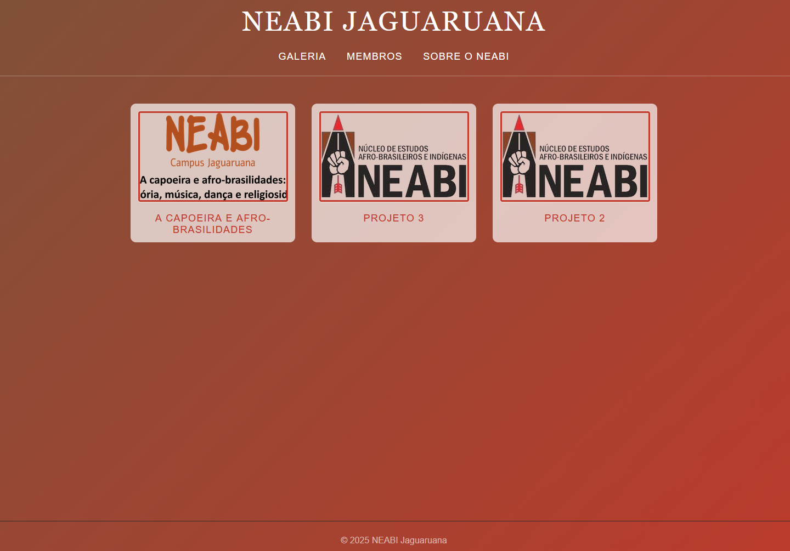
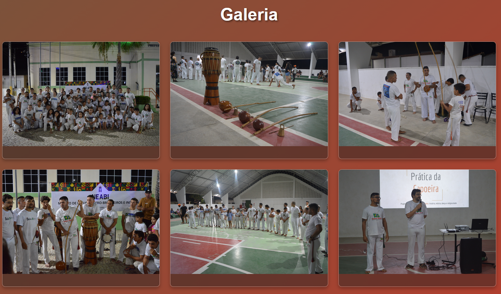

# Projeto NEABI Jaguaruana - Galeria Interativa

Este projeto visa a criação de uma galeria interativa e um site institucional para o Núcleo de Estudos Afro-Brasileiros e Indígenas (NEABI) do IFCE Campus Jaguaruana. O design foi inspirado na estética minimalista e elegante do site `fiftycoffees.com`, incorporando a identidade visual e as cores representativas do NEABI.

## Imagens




## 1. Tecnologias Utilizadas

O projeto é construído sobre o ecossistema Vercel/Next.js, utilizando as seguintes ferramentas e tecnologias:

| Categoria | Tecnologia | Descrição |
| :--- | :--- | :--- |
| **Frontend** | Next.js (React) | Framework principal para renderização Server-Side (SSR) e Client-Side (CSR). |
| **Estilização** | CSS Modules | Utilizado para isolar estilos por componente, garantindo a modularidade. |
| **Banco de Dados** | Neon (PostgreSQL) | Banco de dados relacional escalável, utilizado para armazenar metadados da galeria e informações do NEABI. |
| **Hospedagem de Imagens** | Imgur | Serviço de hospedagem de ativos digitais (CDN) para servir as imagens da galeria de forma eficiente. |
| **Lógica de Estado** | React Hooks (`useState`) | Utilizado no componente cliente para gerenciar o estado do modal de zoom. |

## 2. Funcionalidades Implementadas

O projeto possui as seguintes funcionalidades principais:

### 2.1. Galeria em Layout Cascata (Masonry)

A galeria utiliza um layout em cascata (Masonry Layout) implementado puramente com CSS (`column-count` e `break-inside: avoid`), garantindo um visual moderno e responsivo que se adapta a diferentes tamanhos de tela.

### 2.2. Modal de Zoom Interativo

Ao clicar em qualquer imagem da galeria, um modal de tela cheia é exibido, permitindo ao usuário visualizar a imagem em tamanho maior e ler a descrição associada. Esta funcionalidade é controlada por um **Client Component** (`GalleryClient.jsx`) para gerenciar o estado de abertura/fechamento.

### 2.3. Identidade Visual Temática

O projeto adota uma paleta de cores baseada nos tons de **Vermelho Terroso** (`#C0392B`) e **Marrom** (`#7B523A`), cores representativas do NEABI IFCE, aplicadas em:
*   Fundo principal da página (gradiente).
*   Estilo global (links e modo escuro).
*   Destaques visuais nos cartões da galeria e na página de detalhes.

## 3. Estrutura do Banco de Dados (Neon/PostgreSQL)

O banco de dados Neon armazena as informações do núcleo. O esquema SQL abaixo deve ser executado para configurar as tabelas:

```sql
-- Tabela para Membros do NEABI
CREATE TABLE membros (
  id SERIAL PRIMARY KEY,
  nome TEXT NOT NULL,
  imagem TEXT,
  email TEXT UNIQUE NOT NULL,
  funcao_neabi TEXT,
  cargo_ifce TEXT,
  created_at TIMESTAMP DEFAULT NOW(),
  updated_at TIMESTAMP DEFAULT NOW()
);

-- Tabela para Projetos
REATE TABLE projetos (
  id SERIAL PRIMARY KEY,
  nome TEXT NOT NULL,
  descricao TEXT,
  imagem TEXT,
  data_inicio DATE NOT NULL,
  data_fim DATE,

  responsavel_id INT,

  created_at TIMESTAMP DEFAULT NOW(),
  updated_at TIMESTAMP DEFAULT NOW(),

  CONSTRAINT fk_projeto_responsavel
    FOREIGN KEY (responsavel_id)
    REFERENCES membros(id)
    ON DELETE SET NULL
);


-- Tabela para Imagens da Galeria
CREATE TABLE gallery (
  id SERIAL PRIMARY KEY,
  image TEXT NOT NULL,
  description TEXT
);
```

## 4. Instalação e Configuração

Para rodar o projeto localmente, siga os passos abaixo:

### 4.1. Pré-requisitos

*   Node.js (versão 18+)
*   Conta no Neon (PostgreSQL)
*   Conta no Imgur (para hospedagem de imagens)

### 4.2. Configuração do Ambiente

1.  **Clone o repositório:**
    \`\`\`bash
    git clone [URL_DO_SEU_REPOSITORIO]
    cd [NOME_DO_PROJETO]
    \`\`\`

2.  **Instale as dependências:**
    \`\`\`bash
    npm install
    # ou yarn install / pnpm install
    \`\`\`

3.  **Variáveis de Ambiente:**
    Crie um arquivo `.env.local` na raiz do projeto e adicione a string de conexão do seu banco de dados Neon:
    \`\`\`
    DATABASE_URL="postgresql://[USER]:[PASSWORD]@[HOST]/[DB_NAME]?sslmode=require"
    \`\`\`

4.  **Configuração do Banco de Dados:**
    Execute o esquema SQL fornecido na Seção 3 no seu banco de dados Neon.

### 4.3. Inserção de Dados

Para que as imagens apareçam na galeria, você deve:

1.  Fazer o upload das imagens para o **Imgur**.
2.  Obter o **Link Direto** (`https://i.imgur.com/...`).
3.  Inserir o `titulo`, o `url` (link do Imgur) e a `descricao` na tabela `galeria_imagens` do seu banco de dados Neon.

### 4.4. Execução do Projeto

Inicie o servidor de desenvolvimento:

\`\`\`bash
npm run dev
\`\`\`

O projeto estará acessível em `http://localhost:3000`.
\`\`\`
